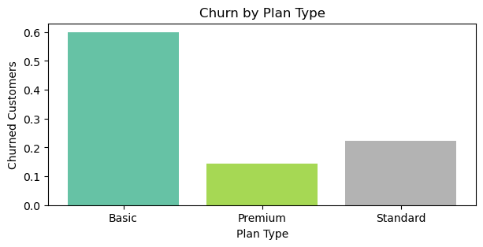
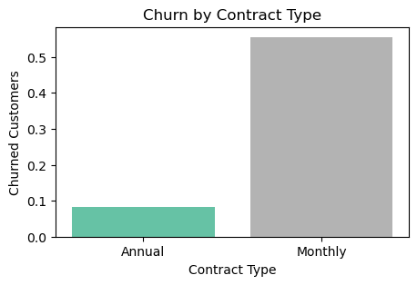
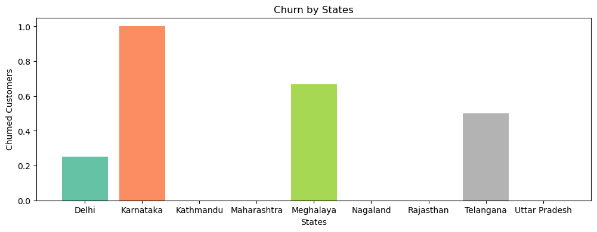
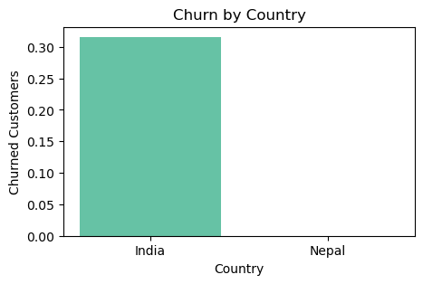
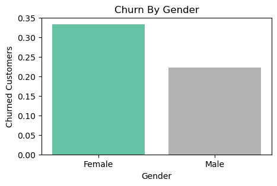
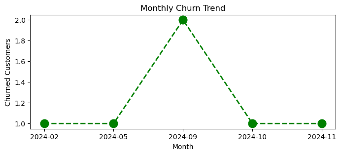
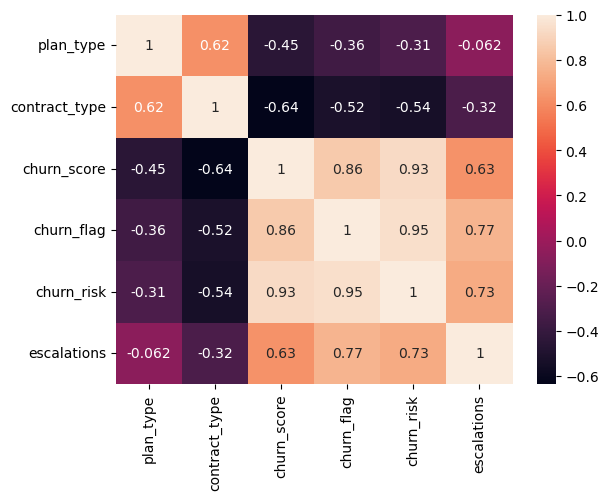

# Customer Churn Analysis 


An end-to-end exploratory analysis of subscription customer churn. The project pulls data from a SQLite database, cleans and joins three tables, engineers churn-related features, calculates key business KPIs, and visualizes what drives customers to leave.

Everything lives in one notebook: [`Churn_analysis.ipynb`](Churn analysis.ipynb). GitHub renders it directly, charts included.

<p align="center">
  
  
</p>

---

## Table of Contents

- [Objectives](#objectives)
- [Tech Stack](#tech-stack)
- [Dataset](#dataset)
- [Workflow](#workflow)
- [KPIs & Results](#kpis--results)
- [Key Insights](#key-insights)
- [Visualizations](#visualizations)
- [Project Structure](#project-structure)
- [Getting Started](#getting-started)
- [Known Limitations](#known-limitations)
- [Future Improvements](#future-improvements)

---

## Objectives

- Load and consolidate customer, subscription, and support data from a SQLite database.
- Clean the data: fix data types, standardize categories, and handle missing values.
- Define churn and build features that describe customer behavior (tenure, age, complaint count, risk band).
- Measure business KPIs such as churn rate, retention, ARPU, and revenue at risk.
- Identify which segments (plan, contract, state, gender) and behaviors (escalations) are linked to churn.

## Tech Stack

| Area | Tools |
| --- | --- |
| Language | Python 3 |
| Data handling | pandas, NumPy |
| Database | SQLite (`sqlite3`) |
| Visualization | Matplotlib, Seaborn |
| Environment | Jupyter Notebook |

## Dataset

The data is stored in a SQLite database, `customer_churn.db`, with three tables linked by `customerid`.

| Table | Rows | Description | Columns |
| --- | --- | --- | --- |
| `db_customer` | 21 | Customer demographics | `customerid`, `name`, `country`, `state`, `gender`, `dob`, `interests`, `pincode` |
| `db_subscription` | 21 | Subscription and billing details | `customerid`, `subscription_start_date`, `subscription_type`, `renewal_date`, `plan_type`, `contract_type`, `cancellation_date`, `cancellation_reason`, `monthly_charges`, `cltv`, `churn_score` |
| `db_support` | 9 | Support complaints | `customerid`, `complaint_date`, `escalations`, `csat_score`, `col_1`, `comment` |

## Workflow

### 1. Data import
Connects to `customer_churn.db`, lists all tables, and loads each one into its own DataFrame (`df_db_customer`, `df_db_subscription`, `df_db_support`).

### 2. Data cleaning

| Table | Step |
| --- | --- |
| Customer | Renamed `name` to `customer_name` |
| Customer | Dropped empty or unused columns (`interests`, `pincode`) |
| Customer | Converted `dob` to datetime |
| Customer | Standardized gender labels (`Men` → `Male`, `Women` → `Female`) |
| Customer | Filled 3 missing `country` values by mapping from `state` |
| Subscription | Converted `subscription_start_date`, `renewal_date`, `cancellation_date` to datetime |
| Support | Dropped empty or free-text columns (`col_1`, `comment`) |
| Support | Converted `complaint_date` to datetime |

### 3. Feature engineering

| Feature | Logic |
| --- | --- |
| `churn_flag` | `1` if `cancellation_date` is present, otherwise `0` |
| `complaint_count` | Number of complaints per customer |
| `age` | Years between `dob` and today |
| `tenure_days` | Days from `subscription_start_date` to `cancellation_date` (or today if still active) |
| `churn_risk` | Band from `churn_score`: `low` (< 50), `mid` (50–70), `high` (> 70) |
| `escalations` | Encoded `Y` → `1`, otherwise `0` |

**Joining the tables:** The support table had multiple complaints for some customers, and a naive left join inflated the merged data from 21 to 23 rows. To fix this, `complaint_count` was calculated first, then the support table was de-duplicated to keep each customer's most recent complaint. The final merge returns one row per customer (21 rows, 21 columns before feature engineering) and is exported to `exported_churn_data.csv`.

### 4. Analysis and visualization
Calculates the KPIs below, then explores churn patterns with Matplotlib and Seaborn charts, correlation heatmaps, and pivot tables.

### 5. Bonus: SQL with pandas
The end of the notebook is a short practice section that creates a small `users` table in a separate `test_database.sqlite`, inserts rows, and runs a `GROUP BY` aggregation. It is unrelated to the churn dataset.

## KPIs & Results

| KPI | Result |
| --- | --- |
| Churn rate | **28.57%** (6 of 21 customers) |
| Retention rate | **71.43%** |
| ARPU (average monthly charge per user) | **18.85** |
| Average customer tenure | **1,544 days** (about 4.2 years)* |
| Revenue at risk (monthly charges of churned customers) | **73.94** (about 18.7% of total monthly charges) |
| Escalation rate | **19.05%** |
| Average complaints per user | **0.43** |
| Correlation: escalation vs. churn | **0.77** |

\*Tenure and age are measured against the date the notebook is run, so these values change over time.

**Churn rate by plan type**

| Plan | Customers | Churn rate | Total monthly charges |
| --- | --- | --- | --- |
| Basic | 5 | 60.00% | 52.95 |
| Standard | 9 | 22.22% | 123.91 |
| Premium | 7 | 14.29% | 218.93 |

**Revenue and users by subscription type**

| Subscription type | Users | Total revenue |
| --- | --- | --- |
| Organic | 9 | 145.91 |
| Paid | 6 | 174.94 |
| Referral | 6 | 74.94 |

**Revenue and users by state**

| State | Users | Total revenue |
| --- | --- | --- |
| Uttar Pradesh | 2 | 115.98 |
| Delhi | 4 | 52.96 |
| Maharashtra | 3 | 50.97 |
| Meghalaya | 3 | 42.97 |
| Rajasthan | 2 | 36.98 |
| Telangana | 2 | 30.98 |
| Nagaland | 1 | 22.99 |
| Karnataka | 2 | 20.98 |
| Kathmandu | 2 | 20.98 |

## Key Insights

- **Plan type is strongly tied to churn.** Basic-plan customers churn at 60%, compared with 22% for Standard and 14% for Premium. Premium also brings in the most revenue.
- **Contract type matters even more.** Monthly contracts churn at roughly 56%, while annual contracts churn at roughly 8%. Moving customers to annual plans looks like the most direct retention lever.
- **Escalated complaints go hand in hand with churn.** The correlation between escalations and churn is 0.77, making escalation handling a natural place to intervene.
- **Some regions are hit harder.** Karnataka (2 of 2 customers) and Meghalaya (2 of 3) show the highest churn, while Nepal shows none. Every state has only a handful of customers, so treat this as a prompt for follow-up rather than a conclusion.
- **Churn is a bit higher among women** (about 33% vs. 22% for men), again on very small counts.
- **Nearly a fifth of monthly revenue is at risk.** Churned customers account for about 18.7% of total monthly charges.
- **Paid acquisition yields the highest revenue** (174.94 from 6 users), while referral customers contribute the least.
- **Uttar Pradesh leads on revenue with only 2 users**, largely because of one Premium customer paying roughly 93 per month, far above everyone else.

> These results come from a very small dataset (21 customers), so treat them as directional patterns rather than statistically reliable conclusions.

### Churn by segment

<p align="center">
  
</p>
<p align="center">
  
  
</p>

### Churn over time

Six cancellations occurred between February and November 2024, with September 2024 the busiest month (2 cancellations).

<p align="center">
  
</p>

### What correlates with churn

`churn_flag` moves closely with `churn_score` (0.86), `churn_risk` (0.95), and `escalations` (0.77), and negatively with `contract_type` (-0.52) and `plan_type` (-0.36). Categories are encoded in their natural order (`Basic < Standard < Premium`, `Monthly < Annual`, `low < mid < high`).

<p align="center">
  
</p>

## Visualizations

**Matplotlib**
- Monthly churn trend (line chart)
- Churn rate by plan type, state, contract type, country, and gender (bar charts)

**Seaborn**
- Correlation heatmap, shown twice to compare encoding methods:
  - Arbitrary numeric codes for categories (labeled "incorrect" in the notebook)
  - Ordered encoding that respects the natural ranking (shown above)
- Pairplot of the encoded features
- Categorical facet plot of monthly charges by plan type, split by gender and churn risk

**Pivot tables**
- Churn rate by plan type
- Churn rate, customer count, and total revenue by plan type

The full set of charts, including the pairplot, is in the notebook.

## Project Structure

```
.
├── Churn_analysis.ipynb        # Main analysis notebook
├── customer_churn.db           # Source SQLite database (required input)
├── exported_churn_data.csv     # Merged, cleaned dataset (generated by the notebook)
├── images/                     # Charts used in this README
├── requirements.txt            # Python dependencies
└── README.md
```


s based on subscription start month.
- Turn the KPIs into a dashboard (Power BI, Tableau, or Streamlit).
